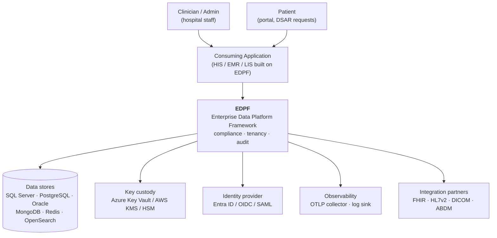
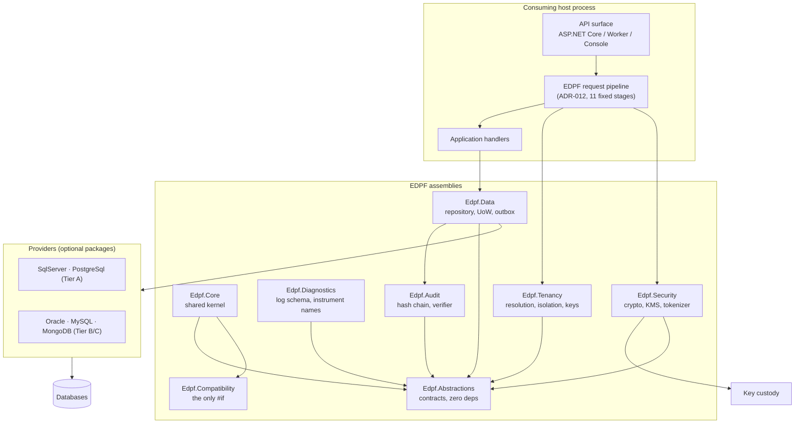
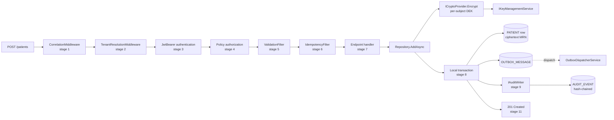

# Phase 00 — Reference architecture (C4 L1–L3)

## C4 L1 — System context

## C4 L2 — Containers (v0.9 scope)

## C4 L3 — Components on the write path

The write path above is not aspirational: it is the code path exercised by
the gate demonstrations in `tests/Edpf.WalkingSkeleton.Tests`, and the stage
order is asserted against ADR-012 by an architecture test.

Detailed code-level diagrams (C4 L4) for the six ADR-fixed paths live in the
master document Part 12; their conformance is asserted by
`DiagramConformanceTests`.
